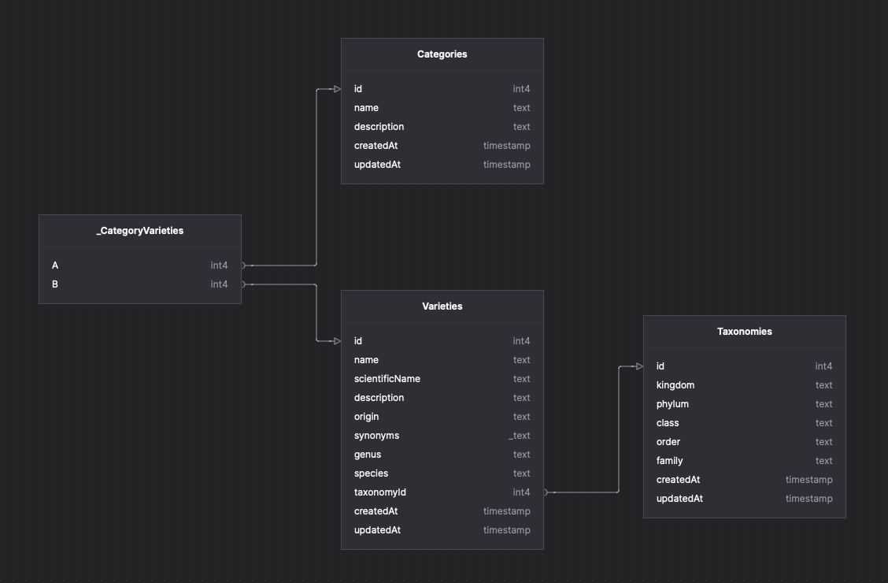

# Plantarium

**Plantarium** is a RESTful API platform designed to provide comprehensive and structured access to a collection of plant data. This project aims to be a primary source of plant information with detailed features including taxonomy, varieties, synonyms, categories, and specific collections.

<summary>
Entity-Relationship Diagram
<details>



</details>
</summary>

## Features

- **Advanced Search**: Supports keyword search, category-based filtering, and advanced search functionalities for easy plant discovery.
- **Relational Data**: Manages relationships between plants, varieties, synonyms, and categories to offer complete and contextual information.
- **JSON API Design**: Adheres to JSON API standards to ensure consistency and interoperability in data communication.
- **Documentation**: Supported by Swagger for API documentation, ensuring transparency and ease of maintenance.

## Goals

- **Organize Plant Data**: Collect and manage data on various types of plants in a structured manner.
- **Facilitate Information Access**: Provide easy and efficient access to plant information for developers, researchers, and general users.
- **Support Research and Development**: Offer a robust data foundation for research and development related to plants.

## Technologies Used

- **Backend**: Hono with Bun and TypeScript
- **Database**: PostgreSQL with Prisma ORM
- **API Documentation**: Swagger

## Installation

1.  **Clone the Repository and Install Dependencies**
    To get started with Plantarium, clone the repository and install the dependencies:

    ```bash
    git clone https://github.com/zckyachmd/plantarium.git
    cd plantarium
    bun install
    ```

2.  **Create .env File**
    To set up your database connection string and other environment variables, create a `.env` file in the root directory of your project.

    ```bash
     cp .env.example .env
    ```

        Edit .env to set up your database connection string and other environment variables.

3.  Run Migrations and Seed
    Create and run migrations the following commands:

    ```bash
    bun run prisma migrate dev --name init
    ```

    Seed data using the following command (optional):

    ```bash
    bun run prisma db seed
    ```

### Usage

```bash
bun run dev
```

Visit `http://localhost:3000` to view the API documentation.

## Contributing

If you'd like to contribute to this project, please follow the [contributing guide](CONTRIBUTING.md) for more information. Thank you!

## License

This project is open source and available under the [MIT License](LICENSE).

## Author

Copyright © 2024 [Zacky](https://zacky.id). Full-Stack Developer and Tech Enthusiast.
